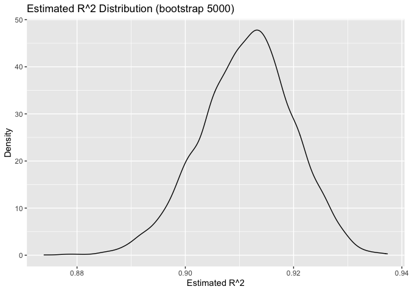
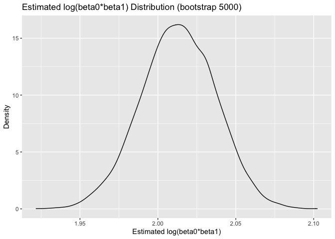
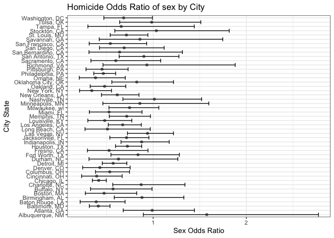

p8105_hw6_yj2688
================

## Problem 1

``` r
weather_df = 
  rnoaa::meteo_pull_monitors(
    c("USW00094728"),
    var = c("PRCP", "TMIN", "TMAX"), 
    date_min = "2017-01-01",
    date_max = "2017-12-31") %>%
  mutate(
    name = recode(id, USW00094728 = "CentralPark_NY"),
    tmin = tmin / 10,
    tmax = tmax / 10) %>%
  select(name, id, everything())

bootstrap = weather_df %>% 
  bootstrap(n = 5000, id = "strap_n") %>% 
  mutate(strap = map(strap, as_tibble), 
         models = map(strap, ~lm(tmax ~ tmin, data = .x)),
         estimates = map(models, broom::tidy),
         summary = map(models, broom::glance)) %>% 
  select(-strap, -models) %>% 
  unnest(c(estimates, summary), names_repair = "universal") 

bootstrap = bootstrap %>%
  select(strap_n, term, estimate, r.squared) %>% 
  pivot_wider(id_cols = c(strap_n, r.squared),
              names_from = term,
              values_from = estimate) %>% 
  rename(beta0 = `(Intercept)`,
         beta1 = "tmin") %>% 
  mutate(logb0_b1 = log(beta0 * beta1)) %>% 
  select(-beta0, -beta1)
```

``` r
r2 = bootstrap %>% 
  select(r.squared) %>% 
  summarize(lowwerbound = quantile(r.squared, 0.025), upperbound = quantile(r.squared, 0.975))

r2 %>%
  knitr::kable(digits = 3)
```

| lowwerbound | upperbound |
|------------:|-----------:|
|       0.894 |      0.927 |

``` r
log = bootstrap %>% 
  select(logb0_b1) %>% 
  summarize(lowwerboundi = quantile(logb0_b1, 0.025), upperbound = quantile(logb0_b1, 0.975))

log %>%
  knitr::kable(digits = 3)
```

| lowwerboundi | upperbound |
|-------------:|-----------:|
|        1.965 |      2.059 |

``` r
bootstrap %>% 
  select(r.squared) %>% 
  ggplot(aes(x = r.squared)) + 
  geom_density() + 
  labs(x = "Estimated R^2",
       y = "Density",
    title = "Estimated R^2 Distribution (bootstrap 5000)")
```

<!-- -->

``` r
bootstrap %>% 
  select(logb0_b1) %>% 
  ggplot(aes(x = logb0_b1)) + 
  geom_density() + 
  labs(x = "Estimated log(beta0*beta1)",
       y = "Density",
    title = "Estimated log(beta0*beta1) Distribution (bootstrap 5000)")
```

<!-- -->
Both the R^2 and log(beta0\*beta1) seems to be normally distributed on
the graph.

## Problem 2

``` r
#Importing the homicide file into R
csvurl <- 'https://raw.githubusercontent.com/washingtonpost/data-homicides/master/homicide-data.csv'
rawhomicide <- read_csv(url(csvurl), show_col_types = FALSE)

homicide <- rawhomicide %>% 
  mutate(city_state = str_c(city,", ",state),
         status = as.numeric(disposition == "Closed by arrest")) %>% 
  filter(!city_state %in% c('Dallas, TX','Phoenix, AZ','Kansas City, MO','Tulsa, AL')) %>%
  mutate(victim_race = fct_relevel(ifelse(victim_race == "White", "white", "non-white"), "white")) %>%
  mutate_at(c('victim_age'), as.numeric)
```

``` r
#use the glm function to fit a logistic regression for Baltimore with resolved vs unresolved as the outcome and victim age, sex and race as predictors
baltimore = homicide %>%
   filter(city_state %in% c('Baltimore, MD'))

fit_logistic = 
  baltimore %>% 
  glm(status ~ victim_age + victim_race + victim_sex, data = ., family = binomial()) 

fit_logistic %>% 
  broom::tidy() %>% 
  mutate(OR = exp(estimate)) %>%
  mutate(low_CI = exp(estimate - std.error * 1.96)) %>% 
  mutate(high_CI = exp(estimate + std.error * 1.96)) %>%
  select(term, log_OR = estimate, OR, p.value, low_CI, high_CI) %>% 
  knitr::kable(digits = 3)
```

| term                 | log_OR |    OR | p.value | low_CI | high_CI |
|:---------------------|-------:|------:|--------:|-------:|--------:|
| (Intercept)          |  1.186 | 3.274 |   0.000 |  2.067 |   5.186 |
| victim_age           | -0.007 | 0.993 |   0.032 |  0.987 |   0.999 |
| victim_racenon-white | -0.820 | 0.441 |   0.000 |  0.313 |   0.620 |
| victim_sexMale       | -0.888 | 0.412 |   0.000 |  0.315 |   0.537 |

``` r
save(fit_logistic, file = "./baltimore_glm.RData")
```

The odds ratio of murder in male is 0.412 times lower than female, 95%
CI: \[0.315, 0.537\].

``` r
#use the glm function to every city
homicide_nest = homicide %>% 
  group_by(city_state) %>% 
  nest() %>% 
    mutate(logit = map(data, ~glm(status ~ victim_sex + victim_race + victim_age, 
                                      family = binomial, data = .x)), 
         logit = map(logit, broom::tidy)) %>% 
  select(-data) %>% 
  unnest() 

model = homicide_nest %>% 
  mutate(OR = exp(estimate), 
         low_CI = exp(estimate - 1.96*std.error), 
         high_CI = exp(estimate + 1.96*std.error)) %>% 
  filter(term == "victim_sexMale") %>% 
  select(OR, low_CI, high_CI)

model %>% knitr::kable(digits = 3)
```

| city_state         |    OR | low_CI | high_CI |
|:-------------------|------:|-------:|--------:|
| Albuquerque, NM    | 1.576 |  0.895 |   2.774 |
| Atlanta, GA        | 0.990 |  0.679 |   1.443 |
| Baltimore, MD      | 0.412 |  0.315 |   0.537 |
| Baton Rouge, LA    | 0.389 |  0.217 |   0.699 |
| Birmingham, AL     | 0.880 |  0.583 |   1.329 |
| Boston, MA         | 0.473 |  0.272 |   0.824 |
| Buffalo, NY        | 0.570 |  0.329 |   0.988 |
| Charlotte, NC      | 0.872 |  0.566 |   1.341 |
| Chicago, IL        | 0.416 |  0.348 |   0.497 |
| Cincinnati, OH     | 0.394 |  0.233 |   0.667 |
| Columbus, OH       | 0.534 |  0.382 |   0.746 |
| Denver, CO         | 0.428 |  0.244 |   0.753 |
| Detroit, MI        | 0.571 |  0.454 |   0.718 |
| Durham, NC         | 0.628 |  0.311 |   1.265 |
| Fort Worth, TX     | 0.837 |  0.547 |   1.281 |
| Fresno, CA         | 0.528 |  0.295 |   0.945 |
| Houston, TX        | 0.723 |  0.597 |   0.877 |
| Indianapolis, IN   | 0.876 |  0.655 |   1.173 |
| Jacksonville, FL   | 0.715 |  0.535 |   0.954 |
| Las Vegas, NV      | 0.939 |  0.724 |   1.218 |
| Long Beach, CA     | 0.510 |  0.269 |   0.970 |
| Los Angeles, CA    | 0.673 |  0.519 |   0.873 |
| Louisville, KY     | 0.480 |  0.299 |   0.771 |
| Memphis, TN        | 0.717 |  0.529 |   0.971 |
| Miami, FL          | 0.527 |  0.315 |   0.881 |
| Milwaukee, wI      | 0.747 |  0.526 |   1.061 |
| Minneapolis, MN    | 0.858 |  0.460 |   1.597 |
| Nashville, TN      | 1.013 |  0.676 |   1.520 |
| New Orleans, LA    | 0.615 |  0.446 |   0.848 |
| New York, NY       | 0.341 |  0.210 |   0.553 |
| Oakland, CA        | 0.479 |  0.325 |   0.706 |
| Oklahoma City, OK  | 0.824 |  0.557 |   1.219 |
| Omaha, NE          | 0.381 |  0.207 |   0.701 |
| Philadelphia, PA   | 0.466 |  0.363 |   0.598 |
| Pittsburgh, PA     | 0.452 |  0.280 |   0.731 |
| Richmond, VA       | 0.932 |  0.462 |   1.881 |
| San Antonio, TX    | 0.900 |  0.635 |   1.277 |
| Sacramento, CA     | 0.599 |  0.332 |   1.081 |
| Savannah, GA       | 0.858 |  0.421 |   1.748 |
| San Bernardino, CA | 0.640 |  0.311 |   1.314 |
| San Diego, CA      | 0.689 |  0.425 |   1.118 |
| San Francisco, CA  | 0.540 |  0.314 |   0.930 |
| St. Louis, MO      | 0.713 |  0.539 |   0.944 |
| Stockton, CA       | 1.034 |  0.589 |   1.817 |
| Tampa, FL          | 0.657 |  0.300 |   1.442 |
| Tulsa, OK          | 0.984 |  0.641 |   1.512 |
| Washington, DC     | 0.684 |  0.471 |   0.992 |

``` r
model %>% 
  ggplot(aes(x = city_state, y = OR)) + 
  geom_point(alpha = 0.50) +
  geom_errorbar(mapping = aes(ymin = low_CI, ymax = high_CI)) +
  theme_bw() +
  theme(legend.position = "none",
        legend.direction = "horizontal",
         legend.key.size = unit(0.04, "cm"))+
  coord_flip() + 
      labs(title = "Homicide Odds Ratio of sex by City", 
        x = "City State",
        y = "Sex Odds Ratio") 
```

<!-- -->
